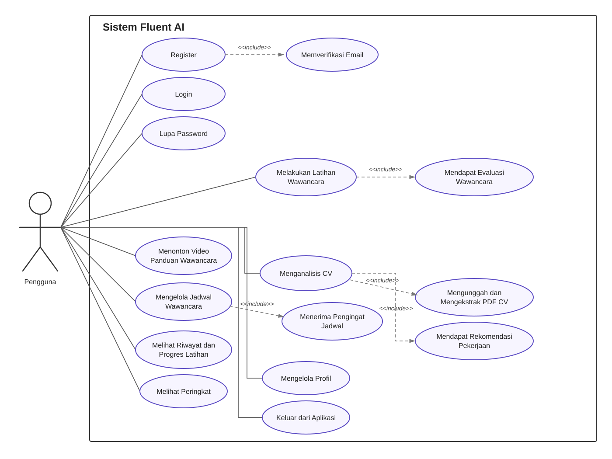

# Use Case Diagram Fluent AI

Use case diagram Fluent AI menggambarkan interaksi pengguna dengan sistem dalam mempersiapkan proses wawancara kerja. Pengguna dapat melakukan register dan login, menggunakan fitur lupa password, melakukan latihan wawancara berbasis AI, memperoleh evaluasi verbal dan nonverbal, menganalisis CV, menonton video panduan, mengelola jadwal wawancara, serta memantau progres dan peringkat. Pengguna juga dapat mengelola profil dan keluar dari aplikasi.

Keterangan relasi `<<include>>`: use case tujuan merupakan proses yang selalu menjadi bagian dari use case utama.
